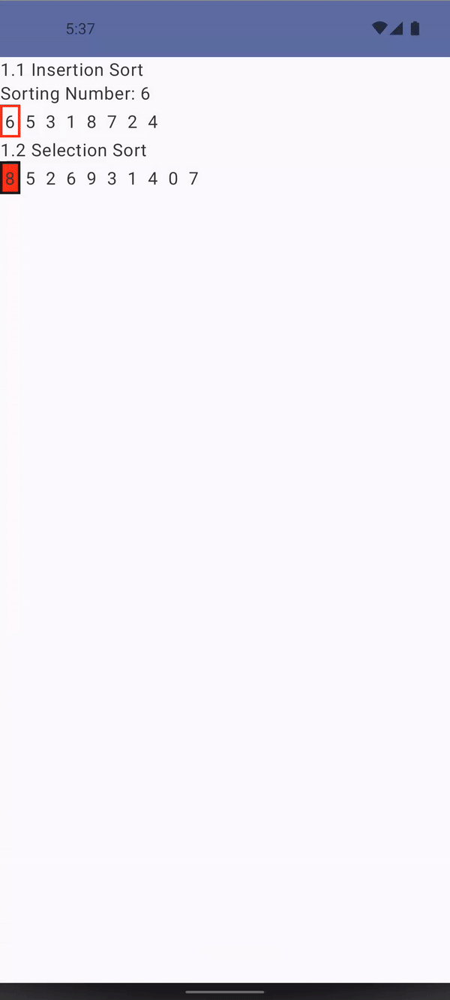

# Kotlin Algorithms

Inspired by [Kotlin-Algorithms](https://github.com/daolq3012/Kotlin-Algorithms) I develop by myself 
an app that demonstrate how each algorithm works using Jetpack Compose UI.

## Insertion Sort

From Wikipedia: Insertion sort is a simple sorting algorithm that builds the final sorted array (or list) one item at a time. It is much less efficient on large lists than more advanced algorithms such as quicksort, heapsort, or merge sort

### Properties

- Worst case performance O(n^2)
- Best case performance O(n)
- Average case performance O(n^2)

## Selection Sort

From Wikipedia: Insertion sort is a simple sorting algorithm that builds the final sorted array (or list) one item at a time. It is much less efficient on large lists than more advanced algorithms such as quicksort, heapsort, or merge sort

### Properties

- Worst case performance O(n^2)
- Best case performance O(n)
- Average case performance O(n^2)